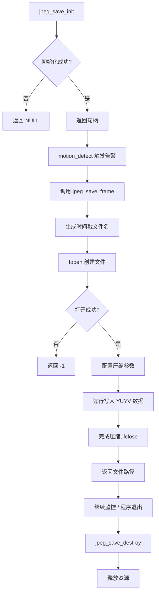

# jpeg_save 模块 —— 概念、流程与选型分析

## 1. 它在 EdgeWatcher 里干什么？

运动检测模块发现画面有变化 → 需要**把当前帧存成图片**，方便事后查看"是谁/什么东西触发了告警"。

EdgeWatcher 的采集管线是：

```
/dev/video0 → V4L2(YUYV) → ring_buffer → motion_detect
                                              ↓
                                         检测到运动
                                              ↓
                                     jpeg_save ← 你在这里
                                              ↓
                                     /data/snapshots/
```

---

## 2. 核心难点：YUYV → JPEG

摄像头给的是 **YUYV 原始数据**（Y 亮度 + UV 色度），一帧 640×480 大约 600KB。如果直接存为文件，体积太大、不是标准格式、没法在电脑/手机上打开。

jpeg_save 的本质工作：**把 YUYV 原始帧压缩成 JPEG 文件**。

---

## 3. 大致流程

```
┌──────────────────────────────────────────────────────────────────┐
│                        jpeg_save_init()                          │
│                                                                  │
│  ① 设置输出目录（如 /data/snapshots/）                            │
│  ② 设置 JPEG 质量参数（默认 75~85）                                │
│  ③ 初始化 libjpeg 的压缩对象（jpeg_compress_struct）               │
│  ④ 初始化 libjpeg 的错误处理（setjmp/longjmp，很关键！）           │
│  ⑤ 返回句柄                                                     │
└──────────────────┬───────────────────────────────────────────────┘
                   ↓
┌──────────────────────────────────────────────────────────────────┐
│                      jpeg_save_frame()                           │
│                                                                  │
│  ① 用时间戳生成文件名：snap_20260609_143021.jpg                    │
│  ② 打开文件（fopen）                                             │
│  ③ 设置压缩参数：宽、高、输入格式（JCS_YCbCr）、质量              │
│  ④ 绑定输出到文件（jpeg_stdio_dest）                              │
│  ⑤ jpeg_start_compress()                                        │
│  ⑥ 逐行喂 YUYV 数据 → YCbCr 转换 → jpeg_write_scanlines()       │
│  ⑦ jpeg_finish_compress()                                       │
│  ⑧ 关闭文件、清理                                                │
│  ⑨ 返回文件路径，方便后续（MQTT 通知/SMS 附带图片路径）           │
└──────────────────┬───────────────────────────────────────────────┘
                   ↓
┌──────────────────────────────────────────────────────────────────┐
│                      jpeg_save_destroy()                         │
│                                                                  │
│  ① 释放 libjpeg 压缩对象                                         │
│  ② 释放自定义句柄内存                                             │
└──────────────────────────────────────────────────────────────────┘
```

### 流程图（Mermaid）



---

## 4. 你需要掌握的知识

### 4.1 YUV 色彩空间（⭐ 必须先看懂）

相机传感器输出的是 **YUV**（也叫 YCbCr），不是 RGB。

| 分量 | 含义 | 人眼敏感度 |
|------|------|-----------|
| **Y** | 亮度（Luma） | 🔴 极敏感 |
| **U/Cb** | 蓝色色度 | 🟢 不敏感 |
| **V/Cr** | 红色色度 | 🟢 不敏感 |

正是利用人眼"对亮度敏感、对颜色迟钝"的特点，JPEG 压缩才能把色度分量大幅压缩而肉眼几乎看不出区别喵。

**YUYV（YUV 4:2:2）的内存布局：**

```
字节:  0    1    2    3    4    5    6    7  ...
      Y0   U0   Y1   V0   Y2   U1   Y3   V1  ...
      └─像素0─┘   └─像素1─┘
```

每两个像素共享一对 UV，所以 4 个像素 = 8 字节（平均每像素 2 字节）。

### 4.2 JPEG 压缩原理（概括）

```
原始图像 (YUYV)
    ↓
色彩空间转换：YUV → 可独立处理的平面
    ↓
下采样（Chroma Subsampling）：色度分量降分辨率（4:2:2 → 4:2:0）
    ↓
分块（8×8 像素块）
    ↓
DCT（离散余弦变换）：空间域 → 频率域
    ↓
量化（Quantization）：高频分量除以系数 → 大量归零（有损！）
    ↓
ZigZag 扫描 + 熵编码（Huffman）
    ↓
JPEG 文件
```

关键点：**量化表（Q-table）决定压缩率和画质**。libjpeg 用 0-100 的 quality 参数映射到内置 Q-table，你不需要手算喵。

### 4.3 libjpeg-turbo（⭐ 核心库）

不要用原始的 **libjpeg**（ijg.org 那版），用 **libjpeg-turbo**：

| 特性 | libjpeg | libjpeg-turbo |
|------|---------|---------------|
| SIMD 加速（NEON/SSE） | ❌ | ✅ |
| 速度 | 基准 | 2~6 倍 |
| API 兼容 | - | 完全兼容 libjpeg |
| 嵌入式友好 | 一般 | ✅ |

i.MX 6ULL 有 ARM NEON，libjpeg-turbo 能用上 NEON 指令加速 DCT，对实时抓拍很重要喵。

**你需要学 6 个核心 API：**

| API | 作用 |
|-----|------|
| `jpeg_create_compress()` | 创建压缩对象 |
| `jpeg_stdio_dest()` | 绑定输出到 FILE* |
| `jpeg_set_defaults()` | 填充默认压缩参数 |
| `jpeg_set_quality()` | 设置质量 0-100 |
| `jpeg_start_compress()` | 开始压缩 |
| `jpeg_write_scanlines()` | 逐行喂数据 |
| `jpeg_finish_compress()` | 结束压缩 |
| `jpeg_destroy_compress()` | 销毁压缩对象 |

### 4.4 错误处理（⭐ 容易被坑）

libjpeg 默认错误处理是 `exit(1)`——在嵌入式设备上直接死进程。

**必须用 `setjmp`/`longjmp` 覆盖默认行为：**

```c
struct my_error_mgr {
    struct jpeg_error_mgr pub;  // 必须第一个成员
    jmp_buf setjmp_buffer;
};
```

任何 libjpeg 内部错误都会跳回你设的 `setjmp` 点，返回错误码而不是崩进程喵。这跟 paho MQTT 的错误回调机制思路类似，但用的是 C 标准库的 `setjmp/longjmp`。

### 4.5 文件命名与管理

时间戳命名最实用：

```
snap_20260609_143021.jpg
     │        │
     │        └─ 时分秒
     └─ 年月日
```

用 `time()` + `localtime()` + `strftime()` 生成，保证文件名唯一且可排序喵。

---

## 5. 为什么选 JPEG？—— 同类方案对比

| 方案 | 单帧 640×480 | 压缩率 | 编解码开销 | 通用性 | 适合嵌入式？ |
|------|-------------|--------|-----------|--------|-------------|
| **BMP/RGB 原始** | 900 KB | 无 | 无 | 🟡 仅 PC | ❌ 太大 |
| **YUV 原始** | 600 KB | 无 | 无 | 🔴 专用工具 | ❌ 不好查看 |
| **PNG** | ~200 KB | 无损 | 高（DEFLATE） | ✅ | 🟡 慢 |
| **JPEG** | **30~80 KB** | **10:1~20:1** | 低（DCT+量化） | ✅ 万能 | ✅ |
| **WebP** | ~20 KB | 更高 | 更高 | 🟡 浏览器先 | ❌ 库太重 |
| **MJPEG 透传** | 不定 | 已有 | 几乎无 | ✅ | ✅ 前提是摄像头支持 |
| **直接存 MJPEG** | 看他摄像头 | 硬件编码 | 最低 | ✅ | ⭐ 加分项 |

### 结论

**JPEG 是嵌入式抓拍的最佳平衡点：**

1. **体积**：600KB → 50KB，SD 卡能存更多
2. **通用**：任何设备都能打开（手机/PC/浏览器）
3. **速度**：libjpeg-turbo + ARM NEON，编码一帧只需几十毫秒
4. **生态**：libjpeg-turbo 已经 20+ 年，稳定到不能再稳定
5. **够用**：监控抓拍不需要无损，画质 75~85 完全能看清人脸/车牌

### ⭐ 额外加分：检查摄像头是否支持 MJPEG

如果你的摄像头支持 MJPEG 格式，V4L2 返回的直接就是 JPEG 数据——意味着**完全跳过 YUYV→JPEG 编码这一步**！

```bash
v4l2-ctl --list-formats-ext -d /dev/video0
```

如果看到 `MJPG`，那你可以做一个捷径：MJPEG 模式下直接 `write()` 到文件，CPU 零开销。如果没有 MJPG，就走 YUYV + libjpeg-turbo 编码路径。两个路径用同一个接口对外，这就是**策略模式**的实际应用喵。

---

## 6. 接口设计预览

```c
// jpeg_save.h
typedef struct jpeg_save_t {
    char output_dir[256];       // 输出目录
    int  quality;               // JPEG 质量 1-100
    int  width, height;         // 图像尺寸
    // ... 内部用 jpeg_compress_struct 等
} jpeg_save_t;

int  jpeg_save_init(jpeg_save_t *js, const char *dir, int w, int h, int quality);
int  jpeg_save_frame(jpeg_save_t *js, const void *yuyv_data, char *out_path, size_t path_len);
void jpeg_save_destroy(jpeg_save_t *js);
```

`jpeg_save_frame` 返回 0 且 `out_path` 填好文件名——MQTT 和 SMS 告警模块就能直接把图片路径附带在通知里喵。

---

## 7. 开发步骤建议

1. **先查摄像头格式**：`v4l2-ctl --list-formats-ext`，确认有没有 MJPEG
2. **交叉编译 libjpeg-turbo**：跟 paho 一样，Ubuntu VM 里用 arm-gcc 编译静态库
3. **先写 test**：给一张已知的 YUYV 数据（或从摄像头 dump 一帧），调用 `jpeg_save_frame`，把输出 `.jpg` 拉到 PC 上打开看
4. **再写实现**：从 test 驱动开发，验证编码 + 文件写入正确
5. **集成到 motion_detect**：触发告警时调用 save

---

## 8. 参考资源

- libjpeg-turbo 官方文档：https://libjpeg-turbo.org/Documentation/Documentation
- libjpeg API 使用指南：https://apjansen.github.io/libjpeg-turbo/
- YUV 格式详解：https://wiki.videolan.org/YUV/
- i.MX 6ULL NEON 支持：ARM Cortex-A7 自带 NEON SIMD
